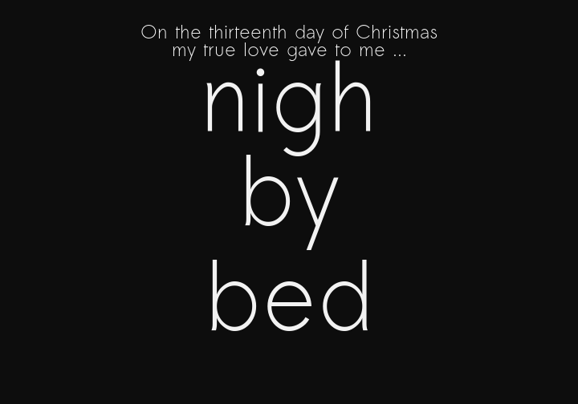

# thirteenth-day
What do you get on the 13th day of Christmas? This contains code and data for
[this `rpub`](http://rpubs.com/markus/338158). If you can't be bothered
clicking, it's a silly response to 
[Bob Rudis's Ode to Christmas
Shopping](https://rud.is/b/2017/12/05/the-cost-of-true-love-a-k-a-the-tidy-and-expensive-twelve-days-of-christmas/)
that trains a deep learning network on Christmas carol texts to ask what you
would get on the 13th day.

And if you really can't be bothered clicking, it is ...

